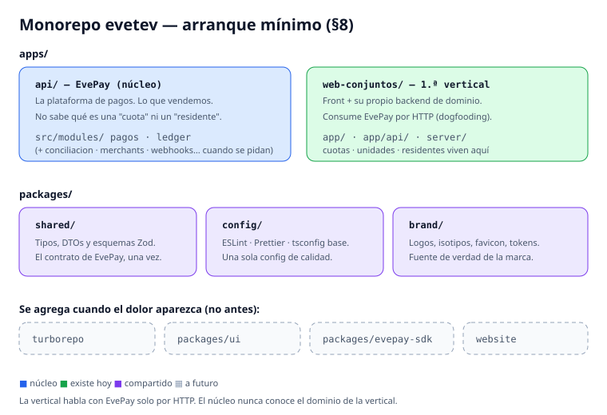

# Estándares de Ingeniería — Evetev SAS

*Estándares de ingeniería de **Evetev SAS**. Nuestro producto es **EvePay**, la plataforma de pagos (PSP/gateway sobre Akua); el **dashboard de conjuntos residenciales** es su primera vertical.*

> Documento vivo. Es la fuente de verdad para que Evetev desarrolle alineada.
> Cualquier cambio se propone por PR sobre este archivo y se discute antes de mergear.
>
> **Contexto del producto:** nuestro **eje central es EvePay, una plataforma de pagos AI-native** (PSP/gateway) construida sobre **Akua** como backbone de adquirencia. Eso es lo que vendemos, a comercios de distintas verticales. El **dashboard de conjuntos residenciales es nuestra primera vertical**: la cuña con la que validamos la plataforma cobrando dinero real a clientes reales — no es el producto, es la prueba viviente de que el producto funciona (somos nuestro primer cliente). Manejamos **dinero de terceros** y **datos personales**, así que la seguridad y la trazabilidad *son* el producto, no un adorno.
>
> **Prioridad actual (0–6 meses):** validar la plataforma de pagos con la primera vertical (conjuntos) cobrando de verdad. Ante la duda, elegimos lo que nos deja lanzar antes sin comprometer los cimientos no-reescribibles: aislamiento multi-tenant (cada comercio es un tenant) e idempotencia/auditoría/conciliación de pagos.

---

## 1. Principios que mandan

Estos principios resuelven las discusiones antes de que ocurran. Cuando dudemos, volvemos aquí.

1. **Vendemos EvePay, la plataforma de pagos — no un dashboard.** El producto es **EvePay**, nuestra infraestructura de pagos (PSP/gateway sobre Akua). Conjuntos es la primera vertical que la valida y la muestra. Cada decisión se juzga por una pregunta: ¿acerca o aleja de una plataforma de pagos vendible a cualquier comercio?
2. **AI-native = datos limpios, no chatbots.** El valor no está en la IA visible, sino en que cada acción quede registrada como evento y que el modelo de datos sea consumible por agentes. Invertimos ahí primero.
3. **Monolito modular, no microservicios.** Un solo despliegue, bien separado en módulos con fronteras claras. Extraemos servicios solo cuando el dolor lo justifique, nunca antes.
4. **API-first y event-logged.** Toda capacidad de la plataforma se expone como API/SDK y emite eventos. Nuestras propias verticales la consumen como lo haría un comercio externo (dogfooding); nunca tocan la base de datos directamente.
5. **No sobre-ingeniar.** Nada de Kubernetes, multi-región, Kafka ni CQRS todavía. La base sólida es un modelo de datos correcto, no una arquitectura compleja.
6. **Los cimientos no-reescribibles van bien desde el primer commit:** aislamiento multi-tenant (cada comercio es un tenant) e idempotencia/auditoría/conciliación de pagos. Lo demás puede ser provisional y feo.
7. **Validar > pulir.** Preferimos la plataforma cobrando de verdad en una vertical real que un módulo perfecto sin usuarios.
8. **Proveedores detrás de interfaces.** **Akua** es nuestro backbone de adquirencia, y habla con nosotros solo a través de la interfaz `PaymentProvider`. No hay agregador intermedio: Akua es el proveedor. La interfaz existe para que el núcleo no dependa de su SDK, no porque planeemos cambiarlo. Lo mismo con notificaciones e IA.

---

## 2. Stack tecnológico

Elecciones por defecto del equipo. Donde hay una bifurcación real, se indica y se decide **una vez, entre todos**, para no fragmentar.

### Lenguaje y frameworks

| Capa | Elección por defecto | Notas |
|---|---|---|
| Lenguaje base | **TypeScript** end-to-end | `strict: true` obligatorio. Tipos compartidos entre front y back. |
| IA / datos | **Python** solo donde la librería lo exija | No mezclar sin razón; aislar en su propio servicio/carpeta. |
| Frontend | **Next.js** (App Router) + React | Mobile-first: los residentes entran desde el celular. |
| Estilos | **Tailwind CSS** + **shadcn/ui** | Componentes accesibles por defecto (ver §5). |
| Backend | **NestJS** (monolito modular) | Módulos con fronteras explícitas. Alternativa válida: Node + framework liviano, pero decidimos uno solo. |
| Validación | **Zod** | Un esquema por frontera de entrada. Nunca confiar en input sin validar. |

### Datos e infraestructura

| Componente | Elección | Notas |
|---|---|---|
| Base de datos | **PostgreSQL** | Relacional + ACID. Obligatorio para dinero. |
| Vectores IA | **pgvector** (misma DB) | Embeddings junto a los datos, sin base extra. |
| Postgres administrado | **Supabase** o **Neon** — *elegir uno* | Supabase suma Auth y RLS integrados; Neon es Postgres puro con branching. |
| ORM / acceso | **Prisma** o **Drizzle** — *elegir uno* | Migraciones versionadas en el repo, siempre. |
| Auth | **Supabase Auth** o **Clerk** — *elegir uno* | No construimos auth a mano. |
| Pagos | **Akua** detrás de la interfaz `PaymentProvider` | Backbone de adquirencia (licencia, procesamiento, settlement). Onboarding vía su equipo de partnerships. Ver §4. |
| Workflows durables | **Inngest** o **Trigger.dev** | Reintentos de pago, cobranza, conciliación. Amigables con agentes. |
| Notificaciones | WhatsApp (API oficial) + email transaccional | Detrás de una interfaz `Notifier`. |
| IA / LLM | API de modelos + RAG con pgvector | Capa delgada. Un agente a la vez, cuando lo pida la validación. |
| Observabilidad | **Sentry** (errores) + **PostHog** (producto/eventos) | PostHog además nutre de eventos limpios a la IA. |
| Hosting | **Vercel** (front) + PaaS (**Railway**/**Render**) + DB administrada | Nada de AWS/K8s todavía. |
| CI/CD | **GitHub Actions** | Lint + typecheck + tests en cada PR. Sin verde no se mergea. |

### EvePay — la plataforma de pagos (nuestro producto)

**EvePay** no es "un módulo más": es lo que vendemos, así que sus atributos de calidad son *features*, no higiene interna. Las capacidades que la definen, en orden de importancia para el MVP:

- **Cobros idempotentes** con clave de idempotencia y máquina de estados clara (creado → pendiente → aprobado/fallido → conciliado).
- **Ledger / libro de movimientos** inmutable: la verdad contable de cada peso que entra y sale.
- **Conciliación** contra el backbone (Akua): lo cobrado cuadra con lo registrado.
- **Webhooks normalizados:** los eventos del proveedor se traducen a *nuestros* eventos internos.
- **Onboarding de comercios** (merchants) con sus datos y, cuando aplique, KYC/KYB.
- **Checkout / elements white-label** embebibles, para que el comercio no toque el PAN — nos mantiene fuera de PCI.
- **Split payments / liquidación** a beneficiarios: más adelante, cuando una vertical lo pida.

Regla: EvePay habla con la adquirencia **solo** por la interfaz `PaymentProvider` (§4). Akua es el backbone detrás de esa interfaz. Como el onboarding de Akua se gestiona con su equipo de partnerships y toma semanas, se arranca **en paralelo** al desarrollo: el núcleo se construye contra la interfaz y se prueba con una implementación *fake* en tests, sin esperar la certificación.

### Lo que NO usamos todavía (para no sobre-ingeniar)

Microservicios · Kubernetes · Kafka/colas pesadas · multi-región · service mesh · monorepo con 20 paquetes. Cuando alguno haga falta de verdad, se propone por PR sobre este documento con la justificación.

---

## 3. Estándares de código y colaboración

Esto es lo que evita que tres personas produzcan tres estilos distintos.

### Estructura del monolito modular

- Un módulo por dominio **en la plataforma de pagos**: `pagos`, `ledger`, `conciliacion`, `merchants`, `webhooks`, `notificaciones`, `identidad`, `ia`. El dominio propio de cada vertical (p. ej. `cuotas`/`unidades`/`residentes` en conjuntos) vive **con su vertical**, nunca en el núcleo de pagos.
- Cada módulo expone una **API pública** (sus casos de uso) y oculta su implementación. Un módulo **no** importa las entrañas de otro: se comunican por la API pública o por eventos.
- Regla de oro: si para tocar el módulo A tengo que abrir el módulo B, la frontera está mal.

### Git y revisión

- **Trunk-based con ramas cortas.** Rama por feature, vida < 2–3 días, PR pequeño.
- **Nada se mergea a `main` sin PR** y sin al menos **1 aprobación** de otra persona.
- **Conventional Commits** (`feat:`, `fix:`, `chore:`, `refactor:`...). Facilita changelog y revisión.
- `main` siempre desplegable. Si está roja, arreglarla es prioridad #1 del equipo.

### Calidad automática (obligatoria en CI)

- **ESLint + Prettier** con config compartida en el repo. Formateo automático; no se discute estilo en reviews.
- **TypeScript en modo `strict`.** Nada de `any` sin comentario justificando.
- El pipeline corre `lint`, `typecheck` y `test`. Rojo = no mergea.

### Testing (pragmático, no dogmático)

No buscamos 100% de cobertura. Buscamos cubrir lo que duele si se rompe:

- **Obligatorio:** lógica de pagos (idempotencia, conciliación) y aislamiento multi-tenant (que un tenant no vea datos de otro). Estos llevan tests sí o sí.
- **Recomendado:** casos de uso del núcleo con reglas de negocio no triviales.
- **Opcional por ahora:** UI puramente presentacional.

### Definición de "listo" técnicamente

Convenciones vivas en el repo: `README.md` (cómo levantar el proyecto en < 15 min), `.env.example` actualizado, y este documento. Si algo cambió cómo se corre el proyecto y no está en el README, el PR no está completo.

---

## 4. Estándares de seguridad

**Innegociable.** Tocamos dinero y PII de residentes. Estas reglas aplican a todo desarrollo desde el día uno.

### Multi-tenancy (aislamiento por conjunto)

- Cada conjunto es un **tenant**. Aislamiento con **Row-Level Security (RLS)** en Postgres, no solo con un `WHERE` en el código.
- Toda tabla con datos de tenant lleva `tenant_id` y su política RLS. Ninguna query cruza tenants.
- Test obligatorio: un usuario del tenant A **jamás** obtiene filas del tenant B, ni por API ni por bug de query.

### Pagos

- **Idempotencia:** toda operación de cobro acepta una clave de idempotencia. Reintentar nunca cobra dos veces.
- **Auditoría inmutable:** cada transición de estado de un pago (creado, pendiente, aprobado, fallido, conciliado) queda registrada con timestamp, actor y datos, sin borrado ni edición.
- **Fuera de alcance PCI:** **nunca** tocamos el número de tarjeta (PAN) en nuestros servidores ni en logs. Usamos checkout/elements embebidos del proveedor. Esto nos mantiene fuera del scope PCI — es una regla dura, no una preferencia.
- **Conciliación** desde el MVP, aunque sea básica: lo cobrado debe cuadrar con lo registrado.

### La interfaz `PaymentProvider` (contrato del equipo)

Todo el núcleo habla con pagos **solo** a través de esta interfaz, y su única implementación real es **Akua**. La interfaz no está para cambiar de proveedor por capricho: está para que ningún módulo dependa del SDK de Akua, para poder testear con un fake, y para no quedar atrapados si algún día el negocio lo exige.

```ts
interface PaymentProvider {
  crearCobro(input: CrearCobroInput, idempotencyKey: string): Promise<Cobro>;
  verificarEstado(cobroId: string): Promise<EstadoCobro>;
  conciliar(rango: RangoFechas): Promise<ResultadoConciliacion>;
  // Webhooks del proveedor se normalizan a nuestros eventos internos.
}
```

Regla: **ningún módulo importa el SDK del proveedor directamente.** Solo la implementación de esta interfaz lo hace.

### Autenticación, autorización y datos

- **RBAC** con roles claros: `super_admin`, `admin_conjunto`, `residente`. Cada endpoint declara qué rol exige.
- **Gestión de secretos:** nunca en el repo. Variables de entorno / gestor de secretos del PaaS. `.env` en `.gitignore`; `.env.example` sin valores reales.
- **Cifrado:** TLS en tránsito (siempre HTTPS) y cifrado en reposo (lo da la DB administrada).
- **Validación de entrada** en toda frontera con Zod. Asumimos que todo input es hostil.
- **OWASP Top 10** como checklist mental: inyección, control de acceso roto, SSRF, etc. Los queries parametrizados y el ORM cubren gran parte, pero el control de acceso lo revisamos a mano.
- **Logs sin PII sensible.** Nada de tarjetas, contraseñas, tokens ni cédulas en logs. Registramos IDs y eventos, no datos personales crudos.
- **Dependencias:** Dependabot activo; revisamos alertas de seguridad. No agregamos dependencias sin necesidad real.

### Protección de datos personales (Colombia — Ley 1581 / Habeas Data)

Manejamos datos de residentes, así que el tratamiento de datos personales está regulado. Diseñamos con esto en mente (y confirmamos los detalles legales con asesoría):

- **Consentimiento y finalidad:** recolectamos solo lo necesario, con propósito declarado.
- **Derechos ARCO** (acceso, rectificación, cancelación, oposición): el diseño debe permitir exportar y borrar los datos de una persona.
- **Política de privacidad** publicada y aceptada en el registro.
- **Minimización:** si un dato no lo necesitamos para el servicio, no lo pedimos ni lo guardamos.

---

## 5. Estándares de accesibilidad

Objetivo: **WCAG 2.2 nivel AA**. Nuestros usuarios son administradores y residentes de todas las edades, muchos desde el celular. Accesible = usable para más gente = más conjuntos que adoptan.

### Reglas base (aplican a toda pantalla)

- **HTML semántico primero.** `button` para acciones, `a` para navegación, encabezados jerárquicos (`h1`→`h2`→`h3` sin saltos). ARIA solo cuando el HTML nativo no alcanza.
- **Contraste de color** mínimo 4.5:1 en texto normal, 3:1 en texto grande y en elementos de interfaz. Nunca comunicar algo **solo** con color (ej. "en rojo = moroso" debe llevar también texto o ícono).
- **Navegable por teclado al 100%.** Todo lo que se hace con mouse se hace con `Tab`/`Enter`/`Esc`. Orden de foco lógico.
- **Foco visible.** Nunca quitar el outline de foco sin reemplazarlo por algo igual de claro.
- **Formularios con `label` real** asociado a cada campo, mensajes de error claros y ligados al campo (`aria-describedby`). Crítico en los flujos de pago: un error ambiguo ahí cuesta plata.
- **Textos alternativos** en imágenes informativas; `alt=""` en las decorativas.
- **Mobile-first y responsive.** Áreas táctiles cómodas (mínimo ~44px), sin scroll horizontal, se usa con una mano.
- **Español claro.** Jerga mínima; los usuarios no son técnicos. "Estado de cuenta", no "balance ledger".
- **Respeta `prefers-reduced-motion`** para animaciones.

### Cómo lo verificamos

- **axe DevTools** o **Lighthouse** (pestaña Accessibility) en cada pantalla nueva; apuntamos a score alto y cero errores críticos.
- Prueba manual rápida: recorrer la pantalla **solo con teclado** antes de dar el PR por listo.
- shadcn/ui y Radix ya traen accesibilidad de base — la aprovechamos y no la rompemos con overrides.

---

## 6. Definition of Done (checklist compartido)

Un desarrollo **no está listo para mergear** hasta cumplir todo esto. Es lo que mantiene alineado el trabajo de los tres, cada uno en su rama.

**Funcionalidad**
- [ ] Hace lo que pide el ticket y se probó el camino feliz + al menos un caso de error.

**Código**
- [ ] Pasa `lint`, `typecheck` y `test` en CI (verde).
- [ ] Sin `any` injustificado; fronteras de entrada validadas con Zod.
- [ ] Respeta las fronteras de módulos (no importa entrañas de otro módulo).
- [ ] PR pequeño, con descripción clara; 1 aprobación de otra persona.

**Seguridad**
- [ ] Datos de tenant aislados por RLS; verificado que no hay fuga entre tenants.
- [ ] Si toca pagos: idempotente, auditado, y **sin** datos de tarjeta en servidor/logs.
- [ ] Sin secretos en el código; `.env.example` actualizado si cambió la config.
- [ ] Endpoints declaran el rol requerido (RBAC); logs sin PII sensible.

**Accesibilidad**
- [ ] Navegable solo con teclado; foco visible.
- [ ] Contraste AA; formularios con labels y errores claros.
- [ ] Lighthouse/axe sin errores críticos en la pantalla nueva.

**Operación**
- [ ] README/.env.example actualizados si cambió cómo se levanta o corre el proyecto.
- [ ] Eventos relevantes se registran (para producto e IA).

---

## 7. Decisiones cerradas

Estas eran las bifurcaciones del stack. Ya están decididas: **no se rediscuten salvo dolor real y demostrable.** Si alguien quiere cambiar una, se propone por PR sobre este documento con la justificación.

| # | Decisión | Elegido | Por qué |
|---|---|---|---|
| 1 | Postgres administrado | **Supabase** | Trae Postgres + Auth + RLS integrados; los claims del JWT alimentan directo las políticas de aislamiento por tenant (§4). Una integración menos. |
| 2 | Auth | **Supabase Auth** | Se resuelve solo con la #1: mismo proveedor, los claims del token son la entrada del RLS. |
| 3 | ORM / acceso a datos | **Drizzle** | SQL-first y liviano; su control explícito de la conexión encaja con el `SET LOCAL app.tenant_id` que exige el RLS. |
| 4 | Workflows durables | **Inngest** | Modelo event-first, alineado con el principio "event-logged" (§1). Reintentos de cobro, cobranza y conciliación. |
| 5 | Proveedor de pagos | **Akua** | Backbone de adquirencia (licencia, procesamiento, settlement, riesgo). **Único proveedor, sin agregador intermedio**, detrás de `PaymentProvider` (§4). |

**Nota operativa sobre Akua:** su habilitación se gestiona con su equipo de partnerships (no es self-service) y toma semanas. Por eso el onboarding corre **en paralelo** al desarrollo: construimos el núcleo contra la interfaz `PaymentProvider` y lo probamos con una implementación *fake* en tests. El día que Akua queda certificado, se enchufa la implementación real sin tocar el núcleo.

### Decisiones que siguen abiertas

- **Notificaciones:** proveedor concreto de WhatsApp Business API y de email transaccional. Se decide cuando se implemente el módulo de cobranza; va detrás de la interfaz `Notifier`, así que no bloquea nada.

---

## 8. Repositorios y GitHub

Coherente con el principio de monolito modular (§1): **un solo monorepo**, no un repo por módulo ni repos separados de front y back. Las fronteras se hacen respetar en el código, no partiendo el repo. Como todo es TypeScript, el monorepo nos da el mayor premio: **tipos compartidos entre la plataforma y las verticales**, una sola fuente de verdad, y un feature que toca varias capas aterriza en un solo PR con un solo CI.

### Por qué un monorepo (y qué NO significa)

Dos conceptos que se confunden y conviene separar:

- **Monorepo** = un solo repositorio con varias apps y paquetes dentro. **Sí, desde ya.**
- **Monolito modular** = un solo backend desplegable con módulos internos, en vez de microservicios. **También sí** (§1).

Son decisiones independientes. Elegimos ambas, por razones distintas.

**Por qué monorepo y no un repo por app:**

1. **Tipos compartidos entre apps.** Es el premio principal y se cobra desde el día uno: el contrato de la API de EvePay (DTOs + esquemas Zod) se define una vez en `packages/shared`. Si cambia un campo, la app consumidora **no compila** hasta actualizarla — el error salta en tu máquina, no en la cara de un merchant.
2. **Un feature aterriza en un solo PR.** Un cambio que toca EvePay, la vertical y los tipos entra junto, con un solo CI y una sola revisión. En repos separados serían tres PRs coordinados a mano.
3. **Refactor sin miedo.** Renombras algo y el compilador te muestra *cada* lugar que se rompió, en todas las apps. Con tres personas en ramas cortas, ese es el tercer par de ojos que no se cansa.
4. **Una sola config de calidad.** ESLint, Prettier y tsconfig se definen una vez en `packages/config` y aplican a todo. No hay forma de que tres personas produzcan tres estilos.

**Lo que NO significa monorepo:**

- No significa que todo se despliegue junto. Cada app tiene su propio pipeline y su propio hosting (§10).
- No significa que las fronteras desaparezcan. **Las fronteras se hacen respetar en el código, no partiendo el repo** — con la regla de lint de imports y con la disciplina de comunicarse por API pública.
- No significa "monorepo con 20 paquetes". Eso está explícitamente en la lista de lo que no hacemos todavía (§2).

**Y no es una puerta de una sola vía.** Si algún día una app necesita repo propio (típicamente: consumidores externos con ciclo de release independiente), extraerla es molesto por el historial de git, pero perfectamente posible. No nos encierra.

### Empezar ligero: el monorepo mínimo

El árbol de abajo es el **destino, no el punto de partida**. Montar las 4 apps y los 4 paquetes antes del primer cobro es exactamente la sobre-ingeniería que §1 prohíbe: sería pulir el contenedor en vez de validar el producto.

**Arranque real (lo que se monta primero):**

```
evetev/
├── apps/
│   ├── api/                # EvePay: módulo `pagos` + lo mínimo de ledger
│   └── eve-conecta/      # la vertical que lo consume
├── packages/
│   ├── shared/             # tipos y esquemas Zod del contrato
│   └── config/             # eslint · prettier · tsconfig
└── pnpm-workspace.yaml
```

Eso es todo. **pnpm workspaces y nada más.** Turborepo, `evepay-sdk`, `ui`, la regla de boundaries y el resto de apps se agregan **cuando el dolor aparezca**, no por anticipado:

| Se agrega… | Cuando… |
|---|---|
| **Turborepo** | los tiempos de CI o de build local empiecen a doler |
| **`packages/ui`** | haya un segundo frontend real (llega rápido: `website`) |
| **`packages/evepay-sdk`** | exista un consumidor externo o una segunda vertical |
| **regla de lint de boundaries** | el equipo crezca o alguien cruce una frontera por accidente |
| **`checkout` / `dashboard-merchant`** | lo pida el primer cliente externo |

Regla general: **no se abstrae al primer uso, se abstrae al segundo.** Con un solo consumidor no sabes qué es genuinamente compartido y qué es específico; adivinar produce la abstracción equivocada.

### El núcleo es EvePay (la plataforma de pagos)

El `api` **es EvePay** — la plataforma de pagos, el producto. `eve-conecta` es la primera vertical y consume EvePay por su API/SDK, igual que lo haría un comercio externo (dogfooding: somos nuestro primer cliente). Punto clave: **EvePay no sabe qué es una "cuota" ni un "residente".** Ese dominio pertenece a la vertical de conjuntos y vive con ella; la vertical le pide cobros a EvePay, y EvePay cobra. Esa ignorancia deliberada es lo que hace la plataforma vendible a cualquier comercio.



**Cómo leer el diagrama:** azul = el núcleo (EvePay y sus módulos) · verde = lo que existe hoy · punteado = lo que se agrega cuando alguien lo pida · morado = lo compartido entre apps.

<details>
<summary>Ver el mismo árbol en texto</summary>

```
evetev/
├── apps/
│   ├── api/                    # NÚCLEO — EvePay, la plataforma de pagos (lo que vendemos)
│   │   └── src/modules/
│   │       ├── pagos/          # cobros idempotentes + máquina de estados
│   │       ├── ledger/         # libro de movimientos inmutable
│   │       ├── conciliacion/   # settlement / reconciliation
│   │       ├── merchants/      # onboarding de comercios (+ KYC/KYB)
│   │       ├── webhooks/       # normaliza eventos del backbone (Akua)
│   │       ├── identidad/      # auth, RBAC, tenants (= comercios)
│   │       └── ia/
│   ├── checkout/               # checkout/elements white-label embebible   (a futuro)
│   ├── dashboard-merchant/     # panel para los comercios clientes          (a futuro)
│   ├── eve-conecta/          # EveConecta — PRIMERA VERTICAL               (hoy)
│   └── website/                # evetev.com — sitio corporativo / marketing  (hoy)
├── packages/
│   ├── evepay-sdk/             # cliente EvePay que consumen verticales y clientes externos
│   ├── shared/                 # tipos, DTOs y esquemas Zod
│   ├── ui/                     # design system compartido (tokens + componentes)
│   └── config/                 # eslint, prettier, tsconfig base
├── docs/
│   ├── ESTANDARES_INGENIERIA.md      # esta constitución
│   ├── ESTANDARES_EVECONECTA.md      # estándares de la primera vertical
│   └── assets/
│       └── estructura-monorepo.svg
├── .github/
│   ├── workflows/              # CI: lint · typecheck · test
│   └── pull_request_template.md
├── pnpm-workspace.yaml
└── turbo.json
```

</details>

**Hoy construyes el mínimo:** `apps/api` con `pagos` (+ lo imprescindible de ledger/conciliación) y `apps/eve-conecta` que lo consume. `checkout`, `dashboard-merchant` y `evepay-sdk` aparecen cuando el primer cliente externo —o la segunda vertical— los pida, no antes. La interfaz `PaymentProvider` y las fronteras de módulos son las costuras que hacen barato ese crecimiento.

### Dónde viven las APIs de una vertical

Pregunta frecuente: si `eve-conecta` necesita endpoints propios (crear cuota, listar morosos, registrar residente), ¿van en el `api` núcleo? **No.**

Si `cuotas`, `unidades` y `residentes` entran a EvePay, la plataforma deja de ser vendible: el día que llegue un ecommerce como cliente, viene contaminada con el dominio de propiedad horizontal. **El dominio de la vertical vive con la vertical.**

```
apps/
├── api/                  # EvePay — SOLO pagos. No sabe qué es una cuota.
│   └── src/modules/      # pagos · ledger · conciliacion · merchants · webhooks · identidad · ia
│
└── eve-conecta/        # LA VERTICAL — front + su propio backend de dominio
    ├── app/
    │   ├── (rutas UI)
    │   └── api/          # ← sus APIs propias: cuotas, unidades, residentes
    └── server/           # casos de uso del dominio conjuntos
```

`eve-conecta` **no es solo un frontend**: es una app completa con su propio backend de dominio, en Route Handlers de Next.js. Cuando necesita cobrar, llama a EvePay por HTTP.

**Por qué no un `apps/api-conjuntos` separado (todavía):** sería una tercera cosa que desplegar y mantener, para un dominio que aún es chico. Con Next.js ya tienes servidor. Se extrae cuando el dolor lo justifique — típicamente cuando aparezca una app móvil de residentes o jobs pesados propios del dominio.

**Datos:** misma instancia de Postgres, **schemas separados** (`evepay` y `conjuntos`). Barato ahora, y la frontera es real: si mañana EvePay necesita su propia base, se mueve un schema.

**Tres reglas duras de frontera:**

1. **Sin llaves foráneas entre schemas.** La tabla `cuota` guarda `evepay_cobro_id` como uuid/texto, sin FK. Los contextos se enlazan por ID, nunca por referencia de base de datos.
2. **Sin imports cruzados.** Ningún módulo de EvePay importa código de la vertical ni consulta su schema. Ni al revés: la vertical no lee tablas de `evepay`, pregunta por la API.
3. **La vertical habla con EvePay solo por HTTP** (vía `evepay-sdk` cuando exista). Estando en el mismo monorepo es tentador importar el módulo de pagos directo — y eso **destruye el dogfooding**. Si nuestra vertical no consume la plataforma como un cliente externo, nunca sabremos si la plataforma sirve para clientes externos.

**Nota sobre identidad:** los **residentes** son usuarios de la vertical (auth en el contexto conjuntos). El **comercio** es el tenant de EvePay. Son dos poblaciones distintas; EvePay no tiene que saber que existen residentes.

> **El test para cualquier caso futuro:** ¿le entregaría este endpoint tal cual a un ecommerce que compre EvePay?
> Si la respuesta menciona "cuota", "torre" o "administrador del conjunto" → es de la vertical.
> Si es "cobro", "comercio", "conciliación" → es del núcleo.

### El sistema de diseño (`packages/ui`)

Es transversal a todas las superficies: `website`, `eve-conecta`, y mañana `checkout` y `dashboard-merchant`. **Va dentro del monorepo, no en repo aparte:** un design system en repo propio obliga a publicarlo versionado y cada cambio de un botón se vuelve publicar → bumpear en cada consumidor → PR aparte. Aquí cambias el componente y ves el efecto en todas las apps en el mismo PR. Repo aparte solo tiene sentido con consumidores externos de ciclo independiente — no es nuestro caso.

```
packages/
└── ui/
    ├── tokens/          # primitivos (color, tipografía, espaciado, radios)
    │                    # + semánticos (bg-surface, text-danger, focus-ring)
    ├── components/      # Button, Input, Table, Modal… sobre shadcn/Radix
    ├── patterns/        # compuestos: EstadoCuenta, TablaCobros, FormPago
    ├── styles/          # preset de Tailwind + globals
    └── icons/
```

Separamos **tokens** de **components** a propósito: los tokens son la marca en forma de datos, y son lo que necesitará el `checkout` white-label para que cada comercio lo pinte con *sus* colores sin tocar código. Mezclarlos hoy significa desenredarlos después.

Dos reglas:

- **Ninguna app define colores, tipografías ni espaciados propios.** Si `eve-conecta` necesita un tono nuevo, se agrega como token en `ui`, no como clase suelta en la app.
- **La accesibilidad vive aquí, no en cada pantalla.** El contraste AA, el foco visible y los targets táctiles de ~44px (§5) se resuelven una vez en el componente base. Así el cumplimiento es por defecto y no depende de que cada quien se acuerde en su PR.

- **Herramienta:** pnpm workspaces + Turborepo (Turbo cachea y orquesta `build`/`lint`/`test`). Si al inicio se siente de más, arranca con pnpm workspaces solo y agrega Turbo cuando los tiempos duelan.
- **Fronteras automáticas:** una regla de lint (`eslint-plugin-boundaries` o restricción de imports) que impida que un módulo importe las entrañas de otro. El principio de módulos se vuelve automático, no un acuerdo de honor.
- **Servicio de IA en Python:** cuando aparezca, entra como `apps/ai` en el **mismo** monorepo. Solo le damos repo propio si algún día tiene un ciclo de despliegue genuinamente independiente — hoy no es el caso.

### Organización y repositorio en GitHub

- Creamos una **Organización** de GitHub para Evetev (no repos en cuentas personales). La organización se crea desde una cuenta personal, que queda como dueña; marcamos que es **propiedad de una empresa** (Evetev SAS está constituida).
- El repo `evetev` es **privado**, dentro de la organización: **[github.com/EveTev/evetev](https://github.com/EveTev/evetev)**
- **Plan:** arrancamos en **GitHub Free** (repos privados y colaboradores ilimitados, Actions con minutos gratis). Subimos a **Team** cuando queramos blindar la protección de rama en repo privado — es un clic, no se reconfigura nada.

### Configuración obligatoria (higiene desde el día uno)

- **2FA obligatorio** para toda la organización (Settings → Authentication security). Manejamos dinero y PII: es básico.
- **Branch protection sobre `main`:** exige PR, exige **1 aprobación**, exige **CI en verde** (lint · typecheck · test), y **prohíbe push directo**. (En repo privado suele requerir plan Team.)
- **Secretos** en GitHub Actions secrets / environments, **nunca** en el repo (amarra con §4).
- **Preview deploys por PR** (Vercel, Railway/Render): cada PR levanta una URL desechable con esa versión. Ideal para enseñarle una pantalla a un conjunto piloto o revisar entre los tres sin bajar la rama.

### `pull_request_template.md` (replica el Definition of Done)

Va en `.github/pull_request_template.md`. Así cada PR trae el checklist de §6 ya puesto y nadie lo olvida — es la forma más barata de mantener alineados a los tres.

```markdown
## Qué hace este PR


## Checklist (Definition of Done)

**Funcionalidad**
- [ ] Hace lo que pide el ticket; probado camino feliz + un caso de error.

**Código**
- [ ] `lint`, `typecheck` y `test` en verde.
- [ ] Sin `any` injustificado; fronteras de entrada validadas con Zod.
- [ ] Respeta fronteras de módulos (no importa entrañas de otro módulo).

**Seguridad**
- [ ] Datos de tenant aislados por RLS; sin fuga entre tenants.
- [ ] Si toca pagos: idempotente, auditado, sin datos de tarjeta en servidor/logs.
- [ ] Sin secretos en el código; `.env.example` actualizado si cambió la config.
- [ ] Endpoints declaran rol requerido (RBAC); logs sin PII sensible.

**Accesibilidad**
- [ ] Navegable solo con teclado; foco visible.
- [ ] Contraste AA; formularios con labels y errores claros.
- [ ] Lighthouse/axe sin errores críticos en la pantalla nueva.

**Operación**
- [ ] README/.env.example actualizados si cambió cómo se corre.
- [ ] Eventos relevantes se registran (para producto e IA).
```

---

## 9. Reglas de codificación: Spec-Driven Development (SDD)

Codificamos con **Spec-Driven Development**: la especificación es la fuente de verdad, y el código es un artefacto que se *genera y verifica* a partir de ella. Como somos AI-native y los tres trabajamos con agentes (Claude Code), esto es lo que nos separa del *vibe coding* — prompt al agente y aceptar lo que salga — que es rápido para prototipos y miserable para algo que hay que mantener. La frase que resume todo: **la spec es el prompt.**

Por qué encaja con nosotros: una plataforma de pagos tiene comportamientos que **no** se pueden dejar a la interpretación del agente (idempotencia, máquina de estados, conciliación, aislamiento por tenant). Escribir la spec primero fuerza la claridad ahí, justo donde un error cuesta plata o confianza.

### El loop (Constitución → Especificar → Clarificar → Plan → Tareas → Implementar → Validar)

Todos los frameworks de SDD convergen en el mismo ciclo. El nuestro:

1. **Constitución** — principios, estándares y guardarraíles. **Este documento ES nuestra constitución.** No la reescribimos por feature; la citamos.
2. **Especificar** — qué se construye: problema, usuarios, requisitos, criterios de aceptación. Nada de tecnología todavía.
3. **Clarificar** — resolver ambigüedades, dependencias y casos borde *antes* de planear. El agente no puede corregir una ambigüedad que nunca resolvimos.
4. **Plan** — traducir la intención a arquitectura y restricciones (respetando §2 y §8).
5. **Tareas** — partir el trabajo en unidades implementables (mapea a ramas cortas, §3).
6. **Implementar** — el agente genera código y tests contra la spec; nosotros dirigimos.
7. **Validar** — verificar que la salida cumple la spec y el Definition of Done (§6).

### Nuestro nivel de rigor: *spec-anchored* (no dogmático)

Hay tres niveles: *spec-first*, *spec-anchored* y *spec-as-source*. Nosotros apuntamos a **spec-anchored**: la spec ancla la intención y es el contrato humano↔agente, pero **el código sigue siendo la verdad ejecutable y los tests son el enforcer**. No convertimos la spec en un dios ceremonial; si el código y la spec divergen, actualizamos uno de los dos conscientemente. La spec es un documento vivo, no un archivo de una sola vez.

### Cuándo SÍ escribir spec y cuándo no

El overhead de una spec es real (más tokens, más tiempo). La regla del gatillo:

> **Si me molestaría que el agente interprete el requisito distinto a lo que quise, escribo la spec. Si lo puedo arreglar con un prompt de seguimiento rápido, prompteo directo.**

Aterrizado a nuestro producto:

- **Spec obligatoria (siempre):** todo lo que toque **pagos, dinero, ledger, conciliación, multi-tenancy o RBAC**. Aquí no hay "arreglo rápido"; la precisión es el producto.
- **Spec recomendada:** casos de uso del núcleo con reglas de negocio no triviales, o features que tocan varios módulos.
- **Prompt directo (sin spec):** UI presentacional, ajustes chicos, scripts desechables. *Empieza vibe, termina spec-driven.*

### Herramienta

Usamos **GitHub Spec Kit** (open source, MIT, agnóstico de agente — funciona con Claude Code, que es nuestro caso). Instala comandos de barra en el agente: `/constitution`, `/specify`, `/clarify`, `/plan`, `/tasks`, `/implement`, `/analyze`. Se instala con `uv`:

```bash
uv tool install specify-cli --from git+https://github.com/github/spec-kit.git
specify init <proyecto> --ai claude
```

Alternativas válidas si algún día duele: **Kiro** (IDE de Amazon con spec/plan/tasks nativo) u **OpenSpec** (flujo proposal→apply→archive). Decidimos una y no fragmentamos (misma lógica que §7).

### Dónde viven las specs

Versionadas en el repo, junto al código, entran en el mismo PR que implementan:

```
specs/
└── <feature>/
    ├── spec.md      # qué y por qué + criterios de aceptación
    ├── plan.md      # arquitectura y restricciones
    └── tasks.md     # unidades implementables
```

### Criterios de aceptación en formato EARS

Los criterios se escriben en **EARS** (Easy Approach to Requirements Syntax): frases `CUANDO … EL sistema DEBERÁ …`, testeables y sin ambigüedad. Ejemplo real de nuestro dominio:

> **CUANDO** se recibe una solicitud de cobro con una `idempotencyKey` ya vista, **EL** sistema **DEBERÁ** devolver el cobro existente sin crear uno nuevo ni cobrar de nuevo.

Cada criterio EARS debería poder convertirse en un test. Eso nos lleva al punto siguiente.

### SDD + TDD son socios, no rivales

La **spec dice qué**; los **tests prueban que se cumple**; el código hace ambos verdaderos. Los tests obligatorios de §3 (pagos y aislamiento multi-tenant) se derivan de los criterios EARS de la spec — no se inventan aparte. La spec es lo que evita el fallo más común de los tests generados por IA: que "pasen pero no prueben nada".

### Plantilla mínima de `spec.md`

```markdown
# <Nombre del feature>

## Problema
¿Qué resuelve? ¿Para quién?

## Usuarios / actores
Quién lo usa (comercio, residente, admin, sistema).

## Resultado esperado
Qué pasa cuando funciona bien.

## Requisitos funcionales
- ...

## No-objetivos
- Qué queda fuera de esta versión.

## Casos borde
- Qué puede salir mal (reintentos, fallos del proveedor, concurrencia...).

## Criterios de aceptación (EARS)
- CUANDO ... EL sistema DEBERÁ ...

## Restricciones de la constitución
- Cimientos tocados: multi-tenancy / idempotencia / auditoría (§4).
```

### Costo honesto

SDD consume **~20–40% más tokens por feature** que el vibe coding, porque el agente relee spec, plan y tareas en cada turno. Se paga solo: muchísimos menos ciclos de "regenerar desde cero" y menos deriva arquitectónica. No lo aplicamos a todo (ver el gatillo arriba) justamente para no pagar ese overhead donde no rinde.

### Cómo se integra con el PR

En features con spec, el PR incluye la carpeta `specs/<feature>/` y el reviewer valida contra ella: ¿el código cumple los criterios EARS? ¿los tests se derivan de ellos? Esto se suma al Definition of Done (§6), no lo reemplaza.

---

## 10. Despliegue e infraestructura

Cómo pasa el código de la máquina de cada uno a producción. Coherente con §7 (decisiones cerradas) y §2 (nada de AWS/K8s todavía).

### Topología

| Qué | Dónde | Notas |
|---|---|---|
| `website` (evetev.com) | **Vercel** | Next.js estático (SSG): SEO y velocidad. |
| `eve-conecta` | **Vercel** | Front + sus Route Handlers de dominio (§8). |
| `api` — EvePay | **Railway** | NestJS, monolito modular. Proceso de larga vida. |
| Base de datos | **Supabase** | Postgres + Auth + RLS. Schemas `evepay` y `conjuntos`. |
| Workflows durables | **Inngest** | Reintentos de cobro, cobranza, conciliación. |
| Observabilidad | **Sentry** + **PostHog** | Errores y eventos de producto (que además nutren la IA). |
| Adquirencia | **Akua** | Externo. Solo lo toca la implementación de `PaymentProvider`. |

**Dominios:** `evetev.com` → website · `habitat.evetev.com` → eve-conecta · `api.evetev.com` → EvePay.

### El pipeline

```
Dev (rama corta)  →  PR a GitHub  →  GitHub Actions: lint · typecheck · test
                                              │
                          ┌───────────────────┴───────────────────┐
                     CI en verde                             CI en rojo
                          │                                       │
              preview deploy por PR                         no mergea (§3)
              (URL desechable: Vercel + Railway)
                          │
                    merge a `main`  →  deploy automático a producción
```

- **Preview por PR:** cada PR levanta una URL desechable con esa versión. Sirve para revisar entre nosotros sin bajar la rama, y para enseñarle una pantalla a un conjunto piloto.
- **`main` siempre desplegable** (§3). Si la CI está roja, arreglarla es prioridad #1.
- **Migraciones de base de datos:** versionadas en el repo y aplicadas en el deploy. Nunca a mano en producción.

### Entornos

Tres, y ninguno comparte datos con otro:

1. **Local** — Supabase local o proyecto de desarrollo; `PaymentProvider` con implementación *fake*.
2. **Preview** — efímero por PR, contra la base de desarrollo y el ambiente de pruebas de Akua. **Jamás** contra datos reales.
3. **Producción** — solo desde `main`, con las credenciales productivas de Akua.

### Secretos

Nunca en el repo (§4). Viven en: **GitHub Actions secrets** (para CI), y en las variables de entorno de **Vercel**, **Railway** y **Supabase** (para runtime), separadas por entorno. `.env.example` se mantiene actualizado y sin valores reales.

### Lo que NO montamos todavía

AWS · Kubernetes · Terraform/IaC · multi-región · CDN propio · bastion hosts. El PaaS nos da hoy todo lo necesario. Cuando alguno haga falta de verdad, se propone por PR sobre este documento (§2).
