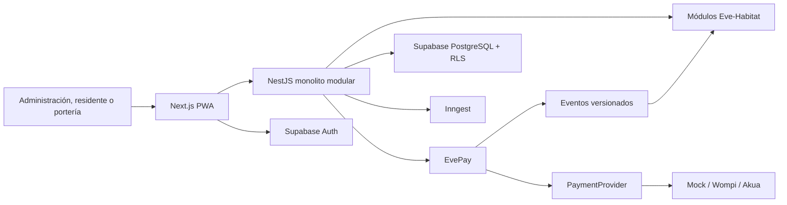

# Arquitectura de Eve-Habitat

## Vista lógica

## Fronteras

- `apps/api/src/evepay`: merchants, pagos, proveedores, webhooks, ledger y
  conciliación. No importa código de `habitat`.
- `apps/api/src/habitat`: operación vertical. Consume eventos de dominio y no
  modelos privados de proveedores.
- `packages/contracts`: única frontera compartida de DTO, tipos y eventos.
- `supabase/migrations`: invariantes que deben sobrevivir a errores de API.

## Flujo crítico de dinero

1. Eve-Habitat solicita el cobro con tenant, merchant, referencia e
   `Idempotency-Key`.
2. EvePay valida comercio, monto y reutilización de la clave.
3. `PaymentProvider` entrega checkout hospedado; EVETEV no recibe PAN.
4. El proveedor confirma mediante webhook firmado. La redirección del navegador
   nunca confirma dinero.
5. EvePay deduplica, aplica una transición válida y publica un asiento de doble
   partida.
6. El evento `payment.approved` aplica el monto a cartera sin crear saldo
   negativo.
7. Inngest ejecuta conciliación diaria; una diferencia queda visible como
   discrepancia.

## Persistencia

Los esquemas PostgreSQL son `identity`, `evepay`, `habitat` y `audit`. Toda tabla
de negocio lleva `tenant_id`, índice compuesto y RLS forzado. El navegador no
recibe permisos sobre `evepay`; opera mediante la API.

La ejecución local de producto usa repositorios en memoria deliberadamente
determinísticos para QA sin secretos. La migración Supabase, los modelos Drizzle
y las pruebas pgTAP son la ruta de persistencia de producción. Sustituir el
repositorio no modifica los casos de uso ni los contratos HTTP.

## Disponibilidad y offline

La PWA conserva el shell y el último snapshot operacional. Portería usa una cola
limitada a eventos mínimos con `client_event_id`, dispositivo y hora local. El
servidor deduplica por tenant/dispositivo/evento. Cartera, documentos personales
y censo completo no forman parte de la caché offline de portería.
