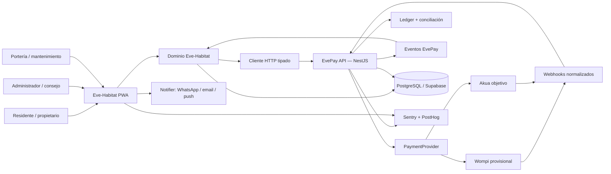
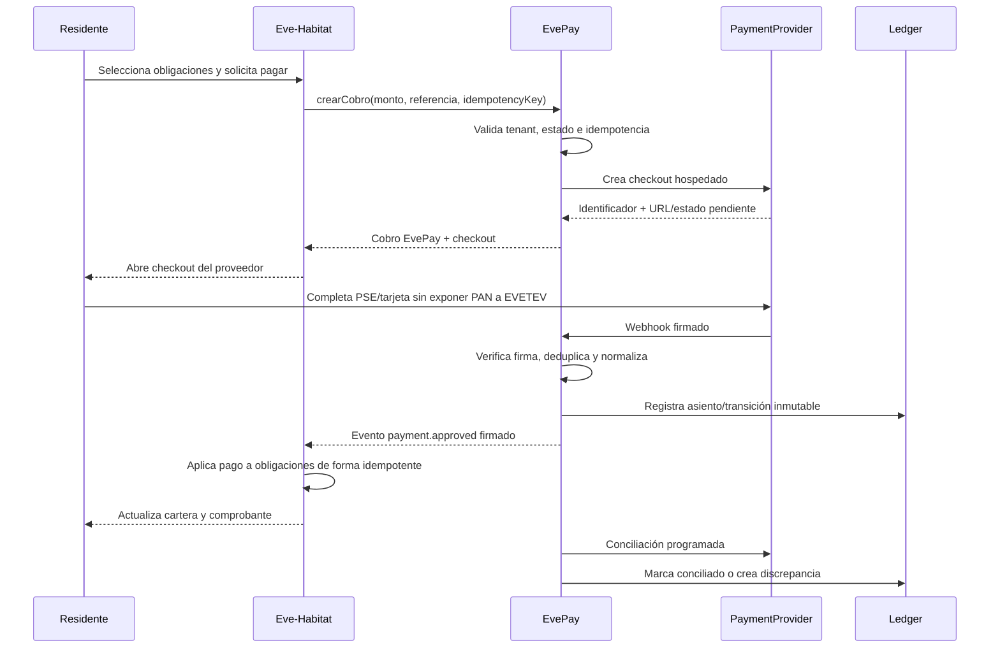

# Fase 3 — Plan de desarrollo de Eve-Habitat

**Aplicación:** Eve-Habitat  
**Empresa:** Evetev SAS  
**Fecha:** 18 de julio de 2026  
**Constitución técnica:** [Estándares de Ingeniería — Evetev SAS](./ESTANDARES_INGENIERIA-EVETEV.md)  
**Entradas de producto:** [Fase 1](./FASE_1_ESTADO_DEL_ARTE.md) · [Fase 2](./FASE_2_BASICOS_Y_DIFERENCIADORES.md)

## 1. Decisión de nombre y relación con EvePay

La vertical de propiedad horizontal se llamará oficialmente **Eve-Habitat**.

Eve-Habitat no reemplaza ni absorbe a EvePay:

- **EvePay** es el producto horizontal de pagos de Evetev: conoce comercios, cobros, proveedores de pago, webhooks, ledger y conciliación.
- **Eve-Habitat** es la primera vertical y el primer cliente real de EvePay: conoce conjuntos, unidades, residentes, cuotas, cartera, portería, mantenimiento y asambleas.
- Un conjunto es un `tenant` de Eve-Habitat y se registra como `merchant` de EvePay mediante un identificador estable.
- Eve-Habitat crea y consulta cobros exclusivamente por la API pública de EvePay. Nunca consulta ni modifica las tablas internas de EvePay.
- EvePay nunca incorpora conceptos como “apartamento”, “residente” o “cuota de administración”. Recibe una referencia externa, un monto y metadatos no sensibles del comercio.

Esta frontera cumple el principio central de ingeniería: la vertical valida EvePay cobrando dinero real sin convertir la plataforma de pagos en un sistema exclusivo para conjuntos.

## 2. Resumen del plan

Se construirá una **versión comercial v1 en seis meses**, organizada por puertas de calidad y no por una gran entrega final. El primer circuito completo de cobro deberá estar listo para piloto al final de la octava semana; los meses restantes amplían la vertical hasta cubrir confianza administrativa, servicios comunitarios, portería resiliente y gobierno.

La secuencia prioriza los cimientos no reescribibles:

1. aislamiento multi-tenant con RLS;
2. identidad, permisos y auditoría;
3. cobros idempotentes;
4. ledger inmutable;
5. webhooks normalizados;
6. conciliación;
7. cuota → cobro → pago → aplicación a cartera en Eve-Habitat.

Después se incorporan los módulos verticales. La hoja de ruta evita construir desde el inicio un ERP contable completo, aplicaciones nativas, hardware propietario o infraestructura distribuida.

### Resultado esperado de la v1

Una empresa administradora podrá crear y operar varios conjuntos; cargar unidades y residentes; liquidar cuotas; recaudar por EvePay; conciliar pagos; gestionar presupuesto, gastos y aprobaciones; enviar comunicaciones; tramitar PQRS; reservar espacios; controlar visitantes y correspondencia aun con conectividad intermitente; administrar mantenimiento; celebrar asambleas; y entregar auditoría/exportación completa.

## 3. Decisiones tecnológicas cerradas

Las bifurcaciones abiertas del estándar quedan resueltas para este proyecto.

| Decisión                | Elección                           | Razón                                                                                                                       |
| ----------------------- | ---------------------------------- | --------------------------------------------------------------------------------------------------------------------------- |
| PostgreSQL administrado | **Supabase**                       | Integra PostgreSQL, Auth y RLS; reduce piezas y hace del aislamiento una política de base de datos                          |
| Autenticación           | **Supabase Auth**                  | Evita construir identidad, comparte JWT con RLS y simplifica invitaciones/recuperación                                      |
| ORM y migraciones       | **Drizzle + Drizzle Kit**          | TypeScript estricto, SQL visible, soporte explícito de políticas RLS y control fino para ledger/constraints                 |
| Workflows durables      | **Inngest**                        | Reintentos por pasos, estado durable, cron, observabilidad e integración TypeScript sin administrar colas                   |
| Proveedor provisional   | **Wompi Colombia**                 | PSE y tarjetas, checkout alojado/widget, sandbox y webhooks firmados; permite validar antes de Akua                         |
| Backbone objetivo       | **Akua**                           | Es el backbone estratégico definido por Evetev; su API documenta comercios, pagos, webhooks, idempotencia y métodos locales |
| Frontend                | **Next.js App Router + React**     | Estándar EVETEV, SSR cuando aporte valor y PWA mobile-first                                                                 |
| Backend EvePay          | **NestJS**                         | Monolito modular con casos de uso y fronteras explícitas                                                                    |
| Estilos/componentes     | **Tailwind CSS + shadcn/ui/Radix** | Velocidad, consistencia y base accesible                                                                                    |
| Validación              | **Zod**                            | Una fuente compartida de esquemas en todas las fronteras                                                                    |
| Eventos/producto        | **PostHog**                        | Analítica, eventos limpios y feature flags                                                                                  |
| Errores/tracing         | **Sentry**                         | Errores de front, backend y workflows con correlación                                                                       |
| Hosting                 | **Vercel + Railway + Supabase**    | Vercel para Eve-Habitat; Railway para EvePay/Inngest; DB/Auth administrados                                                 |
| Repositorio             | **pnpm workspaces + Turborepo**    | Un monorepo, tipos compartidos y un solo CI para API, vertical y paquetes                                                   |
| Canal móvil             | **PWA antes que apps nativas**     | Instalable, actualizable y apta para modo offline sin duplicar equipos/código                                               |

Supabase documenta RLS integrado con Auth y recomienda no exponer claves que omitan políticas; Drizzle permite declarar y versionar RLS; e Inngest conserva pasos exitosos y reintenta desde el punto de falla. Estas características encajan directamente con los estándares de aislamiento e idempotencia. Fuentes: [Supabase RLS](https://supabase.com/docs/guides/database/secure-data), [Drizzle RLS](https://orm.drizzle.team/docs/rls), [Inngest](https://www.inngest.com/docs/learn/inngest-functions).

Wompi será una implementación reemplazable de `PaymentProvider`, no una dependencia del dominio. Su checkout alojado mantiene el PAN fuera de nuestros sistemas y sus eventos firmados permiten confirmar estados por webhook. Akua se implementará en paralelo contra el mismo contrato. Fuentes: [checkout Wompi](https://docs.wompi.co/docs/colombia/widget-checkout-web/), [eventos Wompi](https://docs.wompi.co/docs/colombia/eventos/), [API Akua](https://docs.akua.la/reference).

### Registros de decisión previstos

Las decisiones quedarán versionadas en `docs/adr/`:

- `ADR-001-supabase-auth-rls.md`;
- `ADR-002-drizzle-y-migraciones.md`;
- `ADR-003-monolito-modular-y-fronteras.md`;
- `ADR-004-payment-provider-wompi-akua.md`;
- `ADR-005-inngest-workflows.md`;
- `ADR-006-pwa-offline-first.md`;
- `ADR-007-ledger-doble-partida.md`;
- `ADR-008-eventos-outbox-inbox.md`.

## 4. Alcance de la versión comercial v1

### 4.1 Capacidades incluidas

**Fundación**

- tenants, usuarios, membresías, roles y delegaciones;
- RLS en todas las tablas de tenant;
- auditoría append-only y catálogo de eventos;
- observabilidad, feature flags y trazabilidad distribuida.

**EvePay**

- onboarding básico de merchant/conjunto;
- API de cobros idempotentes;
- checkout hospedado mediante adaptador;
- máquina de estados de pago;
- recepción, firma, deduplicación y normalización de webhooks;
- ledger inmutable de doble partida;
- conciliación programada y manual;
- discrepancias y cuenta transitoria;
- API OpenAPI versionada y cliente tipado local a Eve-Habitat; el SDK público se extrae cuando exista un segundo consumidor;
- adaptadores Wompi y Akua, con Akua condicionado a credenciales/certificación.

**Eve-Habitat**

- conjuntos, etapas, torres, unidades, coeficientes y módulos de contribución;
- propietarios, arrendatarios, residentes, vehículos y mascotas;
- conceptos de cobro, cuotas, cartera, estados de cuenta y aplicación de pagos;
- presupuesto, gastos, proveedores, soportes y aprobaciones;
- comunicaciones, entregas, biblioteca documental y búsqueda;
- PQRS/incidencias con SLA e historial;
- reservas y cobros asociados;
- visitantes, autorizaciones, minuta, correspondencia y turnos;
- portería PWA con modo offline y sincronización;
- activos, planes y órdenes de mantenimiento;
- asambleas, poderes, quórum, votación por coeficiente y acta;
- paneles, informe de gestión, auditoría y exportación completa;
- consentimiento, solicitudes de titulares y políticas de retención;
- accesibilidad WCAG 2.2 AA.

### 4.2 No objetivos de la v1

- reemplazar íntegramente a un software contable estatutario; la v1 ofrece subledger operacional, reportes, exportación y conector;
- almacenar o procesar PAN; se usa checkout/elements del proveedor;
- split payments o liquidaciones complejas a múltiples beneficiarios;
- apps nativas iOS/Android;
- biometría, reconocimiento facial o hardware de acceso propietario;
- microservicios, Kafka, Kubernetes, CQRS, multi-región o blockchain;
- marketplace público de proveedores;
- mantenimiento predictivo con IoT;
- decisiones automáticas de sanción, acceso o movimiento de dinero mediante IA;
- personalizaciones de código por conjunto.

### 4.3 Expansiones posteriores

- checkout y dashboard de merchants externos de EvePay;
- contabilidad colombiana estatutaria más profunda o conectores adicionales;
- split/liquidaciones;
- integración con Bre-B y nuevos rieles de Akua;
- compras/licitaciones avanzadas y portal de proveedores;
- IoT, consumos, sostenibilidad y movilidad eléctrica;
- aplicaciones nativas solo si la PWA demuestra un límite real;
- asistente documental con RAG y automatizaciones financieras avanzadas.

## 5. Arquitectura lógica



### 5.1 Regla de fronteras

- `apps/api` contiene exclusivamente EvePay y capacidades horizontales compartibles.
- `apps/eve-habitat` contiene la vertical, incluido su BFF y sus módulos de negocio.
- Eve-Habitat puede guardar `evepay_payment_id` y referencias públicas, pero no leer tablas del esquema `evepay`.
- EvePay recibe `external_reference` y metadatos mínimos; no replica PII de residentes salvo lo estrictamente requerido por el proveedor y con finalidad documentada.
- Los módulos se comunican por API pública o eventos versionados.
- Solo `provider-adapters/wompi` y `provider-adapters/akua` pueden importar SDKs o contratos del proveedor.
- Una regla de lint de fronteras impedirá imports internos entre módulos.

### 5.2 Monorepo

```text
evetev/
├── apps/
│   ├── api/                         # EvePay — NestJS
│   │   └── src/
│   │       ├── modules/
│   │       │   ├── identity/
│   │       │   ├── merchants/
│   │       │   ├── payments/
│   │       │   ├── ledger/
│   │       │   ├── webhooks/
│   │       │   ├── reconciliation/
│   │       │   ├── notifications/
│   │       │   └── audit/
│   │       ├── provider-adapters/
│   │       │   ├── wompi/
│   │       │   └── akua/
│   │       └── workflows/
│   └── eve-habitat/                 # Next.js PWA + vertical
│       └── src/
│           ├── app/
│           ├── modules/
│           ├── server/
│           ├── offline/
│           └── workflows/
├── packages/
│   ├── evepay-sdk/                   # futuro: se extrae con un segundo consumidor
│   ├── shared/                      # DTOs y Zod; sin lógica de dominio
│   ├── ui/
│   └── config/
├── specs/
├── docs/
│   ├── adr/
│   ├── runbooks/
│   └── ESTANDARES_INGENIERIA.md
├── drizzle/
├── .github/workflows/
├── pnpm-workspace.yaml
└── turbo.json
```

### 5.3 Datos y esquemas

Cada ambiente usa un proyecto Supabase independiente. Dentro de PostgreSQL:

- `identity`: usuarios, tenants, membresías, roles y delegaciones;
- `evepay`: merchants, pagos, ledger, webhooks y conciliación;
- `habitat`: datos de la vertical;
- `audit`: eventos inmutables y outbox;
- `storage`: metadatos de archivos, conservando objetos en almacenamiento administrado.

Roles de base de datos separados impiden que Eve-Habitat consulte `evepay`. Toda tabla de negocio lleva `tenant_id`, índice compuesto y RLS `default deny`. El rol de aplicación no tendrá `BYPASSRLS`. Las operaciones administrativas que lo requieran usarán un proceso explícito, auditado y limitado; nunca una clave privilegiada en el navegador.

## 6. Mapa de dominios

### 6.1 EvePay

| Módulo            | Responsabilidad                                     | Invariantes principales                               |
| ----------------- | --------------------------------------------------- | ----------------------------------------------------- |
| Identity          | Autenticación técnica, tenant y credenciales de API | Una credencial pertenece a un merchant/tenant vigente |
| Merchants         | Onboarding y configuración del comercio             | Estado y proveedor habilitado explícitos              |
| Payments          | Crear cobros y administrar máquina de estados       | Idempotencia; transiciones válidas; montos enteros    |
| Provider adapters | Traducir el contrato interno                        | Ninguna fuga de modelos del proveedor al dominio      |
| Webhooks          | Verificar, persistir y normalizar eventos           | Firma válida; inbox deduplicado; respuesta rápida     |
| Ledger            | Registrar movimientos de doble partida              | Débitos = créditos; nunca update/delete               |
| Reconciliation    | Comparar proveedor, pagos y ledger                  | Toda diferencia termina conciliada o explicada        |
| Notifications     | Entregar eventos al merchant                        | Reintentos, firma y deduplicación                     |
| Audit             | Registrar acciones y cambios                        | Append-only; actor, tenant, tiempo y correlación      |

### 6.2 Eve-Habitat

| Módulo               | Responsabilidad                                                                      |
| -------------------- | ------------------------------------------------------------------------------------ |
| Communities          | Configuración del conjunto, etapas, torres, unidades y coeficientes                  |
| People & occupancy   | Personas, propietarios, residentes, ocupaciones, delegaciones, vehículos y mascotas  |
| Fees & portfolio     | Conceptos, liquidaciones, cuentas por cobrar, mora, acuerdos y aplicación de pagos   |
| Budget & expenses    | Presupuesto, fondos, gastos, soportes, proveedores y aprobaciones                    |
| Communications       | Comunicados, entregas, documentos, versiones y notificaciones                        |
| Cases                | PQRS, convivencia, incidentes, SLA, evidencias y escalamiento                        |
| Amenities            | Recursos, reglas, reservas, depósitos y cobros                                       |
| Gatehouse            | Visitantes, accesos, correspondencia, minuta, turnos y sincronización offline        |
| Assets & maintenance | Activos, planes, inspecciones, órdenes, materiales, costos y garantías               |
| Governance           | Consejo, asambleas, poderes, quórum, votaciones, decisiones y actas                  |
| Reports & trust      | Paneles, auditoría legible, informe de gestión y exportación                         |
| Privacy              | Consentimientos, finalidades, retención, consulta, corrección y supresión procedente |
| Intelligence         | Extracción/clasificación y RAG, después de tener datos y permisos confiables         |

## 7. Flujo crítico de dinero



### Reglas no negociables

- montos como enteros en unidad menor y moneda ISO; nunca `float`;
- clave única `(tenant_id, operation, idempotency_key)`;
- referencia externa única y no reutilizable;
- webhook persistido antes de procesarse, con firma y `provider_event_id` únicos;
- eventos duplicados o fuera de orden no retroceden un estado final;
- asiento de ledger balanceado dentro de una transacción ACID;
- correcciones mediante asientos reversos, nunca edición;
- aplicación a cartera separada del estado de pago y también idempotente;
- redirección del navegador solo informa; el webhook o verificación del proveedor confirma;
- conciliación diaria y bajo demanda desde el primer piloto;
- diferencias van a una bandeja y cuenta transitoria; nunca se ocultan.

## 8. Portería offline-first

La PWA de portería tendrá un modelo deliberadamente limitado para reducir riesgo:

1. el dispositivo se registra y vincula a un tenant/portería;
2. descarga autorizaciones vigentes y listas operativas mínimas cifradas;
3. valida QR/PIN localmente cuando no hay red;
4. registra eventos en una cola local con identificador determinístico, hora del dispositivo y secuencia;
5. al recuperar conexión envía lotes idempotentes;
6. el servidor conserva hora recibida, resuelve conflictos y devuelve acuse;
7. los datos vencen y se eliminan del dispositivo según política;
8. pérdida o revocación del dispositivo invalida nuevas sincronizaciones.

No se almacenarán en offline estados de cuenta, documentos personales ni el censo completo. Un ingreso en contingencia quedará marcado como tal y será visible en la auditoría.

## 9. Seguridad, privacidad y marco legal

### 9.1 Modelo de autorización

Roles iniciales:

- `platform_super_admin`;
- `merchant_admin`;
- `habitat_admin`;
- `council_member`;
- `accountant`;
- `auditor_readonly`;
- `gatekeeper`;
- `maintenance_worker`;
- `owner`;
- `resident`;
- `vendor_limited`.

Cada endpoint declara permiso y alcance de tenant. Los roles son conjuntos de permisos versionados; las delegaciones tienen inicio, fin, unidad y propósito. Para pagos, gastos, exportaciones masivas y cambios de rol se exige autenticación reforzada y reautenticación reciente.

### 9.2 Controles obligatorios

- RLS y pruebas negativas por tabla/rol;
- MFA para roles administrativos y de plataforma;
- rate limiting por IP, usuario, tenant y credencial;
- validación Zod y límites de tamaño/tipo en archivos;
- URLs firmadas de corta vida para documentos;
- antivirus/escaneo de adjuntos antes de disponibilidad;
- secretos en environments; rotación y separación por ambiente;
- verificación de firma, timestamp y replay de webhooks;
- logs estructurados sin cédulas, correos, teléfonos, tokens ni datos de tarjeta;
- CSP, cookies seguras, protección CSRF donde aplique y cabeceras de seguridad;
- Dependabot, secret scanning, CodeQL/SAST y revisión de dependencias;
- threat model STRIDE para pagos, acceso offline, votaciones y exportaciones;
- backups y restauraciones probadas;
- plan de respuesta y notificación de incidentes.

### 9.3 Protección de datos

La aplicación incorporará:

- registro de finalidad, base/autorización, versión de política y evidencia de aceptación;
- minimización y clasificación de datos;
- flujos de consulta, actualización, rectificación, revocación y supresión cuando proceda;
- retención por categoría y bloqueo legal cuando exista obligación de conservar;
- contrato/registro de encargado y subencargados;
- exportación legible del titular;
- trazabilidad de quién consultó datos sensibles;
- configuración de comunicaciones no esenciales y prueba de autorización.

La implementación se validará con asesoría jurídica antes de producción. La [Ley 675](https://www.suin-juriscol.gov.co/viewDocument.asp?ruta=Leyes%2F1665811) exige, entre otros aspectos, coeficientes, órganos de administración y debido proceso; la [SIC](https://sedeelectronica.sic.gov.co/politica-de-tratamiento-de-datos-personales) destaca finalidad, autorización, seguridad, acceso restringido y derechos del titular; y la [Ley 527](https://www.suin-juriscol.gov.co/viewDocument.asp?ruta=Leyes%2F1662013) enmarca mensajes de datos y firmas. El software facilitará evidencia y configuración, pero no afirmará “cumplimiento automático” sin revisión del caso y reglamento de cada copropiedad.

### 9.4 Asambleas y decisiones

- coeficientes y módulos de contribución son datos versionados;
- el quórum se calcula sobre asistentes/poderes vigentes;
- cada voto conserva identidad autorizada, pregunta, opciones, coeficiente aplicable y sello de tiempo;
- el sistema bloquea doble representación y voto duplicado;
- correcciones se hacen por evento compensatorio, no editando el voto original;
- convocatoria, entrega, poderes, resultados y acta forman un expediente exportable;
- sanciones y conflictos mantienen descargos, notificaciones, decisión e impugnación;
- reglas legales/reglamentarias se parametrizan y se revisan jurídicamente.

## 10. Accesibilidad y experiencia

### Principios

- mobile-first para residentes y portería; escritorio eficiente para administración/contabilidad;
- WCAG 2.2 AA como criterio de aceptación, no revisión posterior;
- español claro y lenguaje acorde al rol;
- ninguna acción depende solo de color, gesto o puntero;
- navegación completa por teclado y foco visible;
- áreas táctiles mínimas de aproximadamente 44 px;
- formularios con etiquetas, instrucciones y errores relacionados;
- `prefers-reduced-motion`, contraste y zoom sin pérdida;
- tablas con alternativa móvil y exportación;
- comprobantes y actas accesibles;
- canal web/PWA como base; WhatsApp, email y push son notificaciones/adaptadores, no fuentes de verdad.

### Sistema de diseño

`packages/ui` contendrá tokens, componentes, patrones de formularios, estados vacíos/error/carga y ejemplos accesibles. Storybook se añadirá solo si acelera revisión; no es requisito para iniciar. Cada pantalla nueva pasa axe/Lighthouse y una prueba manual únicamente con teclado.

## 11. Spec-Driven Development

El archivo de estándares funciona como constitución. Cada capacidad crítica tendrá `spec.md`, `plan.md` y `tasks.md` en el mismo PR.

### Specs obligatorias iniciales

1. `tenant-isolation`;
2. `rbac-and-delegations`;
3. `merchant-onboarding`;
4. `create-payment-idempotency`;
5. `provider-webhooks`;
6. `ledger-posting`;
7. `reconciliation`;
8. `fee-assessment`;
9. `payment-allocation`;
10. `expense-approval`;
11. `offline-gatehouse-sync`;
12. `assembly-quorum-voting`;
13. `privacy-data-subject-request`;
14. `tenant-data-export`.

### Ejemplos de criterios EARS

- **CUANDO** EvePay recibe una clave de idempotencia ya procesada para el mismo tenant y operación, **EL sistema DEBERÁ** devolver el cobro original sin crear otro intento ni asiento.
- **CUANDO** llega dos veces el mismo evento firmado del proveedor, **EL sistema DEBERÁ** conservar ambas recepciones técnicas pero aplicar una sola transición de dominio.
- **CUANDO** un usuario del tenant A solicita un recurso del tenant B, **EL sistema DEBERÁ** responder sin revelar la existencia del recurso y registrar el intento de acceso.
- **CUANDO** un asiento es confirmado, **EL sistema DEBERÁ** impedir su edición o eliminación y exigir un asiento reverso para corregirlo.
- **CUANDO** portería recupera conexión, **EL sistema DEBERÁ** sincronizar cada evento offline exactamente una vez desde la perspectiva del dominio.
- **CUANDO** cambia un coeficiente después de una liquidación, **EL sistema DEBERÁ** conservar la liquidación histórica con la versión aplicada originalmente.
- **CUANDO** una persona ejerce un derecho sobre sus datos, **EL sistema DEBERÁ** producir un expediente de atención sin borrar registros sujetos a obligación legal o contable.

## 12. Estrategia de pruebas

| Nivel          | Objetivo                                | Ejemplos obligatorios                                                                              |
| -------------- | --------------------------------------- | -------------------------------------------------------------------------------------------------- |
| Unitarias      | Reglas puras                            | estados de pago, coeficientes, intereses, quórum, aprobaciones, conflictos offline                 |
| Integración DB | Constraints, transacciones y RLS reales | tenant cruzado, ledger balanceado, deduplicación, migraciones                                      |
| Contrato       | Estabilidad de fronteras                | `PaymentProvider`, API EvePay/cliente tipado, webhooks, `Notifier`, exportación                    |
| E2E            | Recorridos de usuario                   | liquidar/pagar/aplicar; gasto/aprobar/reportar; visitante offline/sincronizar; asamblea/votar/acta |
| Accesibilidad  | WCAG y operación sin mouse              | axe, teclado, foco, errores de formularios, lector de pantalla en flujos críticos                  |
| Seguridad      | Controles negativos                     | autorización, RLS, replay webhook, archivos, rate limits, sesión/roles                             |
| Rendimiento    | Latencia y concurrencia                 | creación de cobro, ráfaga de webhooks, búsqueda portería, liquidación masiva                       |
| Recuperación   | Resiliencia                             | proveedor timeout, evento fuera de orden, workflow agotado, restore de backup                      |

No se fija una meta global de cobertura que incentive tests vacíos. Sí se exige cobertura exhaustiva de invariantes de pagos, ledger, conciliación y multi-tenancy. Los criterios EARS se enlazarán a tests por identificador.

### Casos de pago imprescindibles

- doble clic/reintento simultáneo con la misma clave;
- misma clave con payload diferente;
- proveedor responde y luego hay timeout;
- webhook duplicado, inválido, retrasado y fuera de orden;
- pago aprobado que el proveedor todavía no liquida;
- liquidación con monto/comisión diferente;
- pago parcial, excedente, reverso y no identificable;
- caída de Inngest y reanudación desde el último paso;
- tenant equivocado en referencia o credencial;
- despliegue entre creación y recepción del webhook.

## 13. Observabilidad, auditoría y objetivos de servicio

### Telemetría

- `request_id`, `correlation_id`, `tenant_id`, `actor_id` y entidad técnica en logs;
- eventos con nombre `dominio.entidad.accion.v1`;
- Sentry para errores, trazas y releases;
- PostHog para uso, funnels y feature flags;
- panel operativo de pagos, webhooks, conciliaciones, workflows y sincronización offline;
- alertas de discrepancia, cola estancada, fallo permanente, picos de denegación y errores de proveedor;
- auditoría de negocio separada de logs técnicos.

### Objetivos iniciales

| Indicador                                                |                              Objetivo v1 |
| -------------------------------------------------------- | ---------------------------------------: |
| Disponibilidad mensual de EvePay y Eve-Habitat           | 99,9% excluyendo mantenimiento anunciado |
| Creación de cobro p95, sin contar checkout del proveedor |                                    < 2 s |
| Confirmación interna tras webhook p95                    |                                   < 60 s |
| Búsqueda/autorización online en portería p95             |                                    < 1 s |
| Validación local offline                                 |                                 < 500 ms |
| RPO                                                      |                                 ≤ 15 min |
| RTO                                                      |                                    ≤ 4 h |
| Discrepancias sin responsable al cierre diario           |                                        0 |
| Errores críticos de accesibilidad en release             |                                        0 |

Los objetivos se validarán contra el plan contratado del proveedor antes de prometerlos comercialmente.

## 14. CI/CD y ambientes

### Ambientes

- `local`: servicios locales y proveedores en sandbox;
- `preview`: por PR, datos efímeros y nunca producción;
- `staging`: Supabase/proveedores separados, pruebas de migración y aceptación;
- `production`: credenciales, proyectos y dominios exclusivos.

### Pipeline de cada PR

1. instalación reproducible con lockfile;
2. formato/lint;
3. TypeScript `strict`/typecheck;
4. reglas de fronteras;
5. tests unitarios;
6. integración con PostgreSQL real y políticas RLS;
7. build de API/PWA/paquetes;
8. escaneo de secretos, dependencias y CodeQL;
9. E2E selectivo y axe en flujos tocados;
10. preview deploy;
11. migración validada sobre copia/esquema temporal.

### Despliegue

- merge a `main` solo por PR, una aprobación y CI verde;
- staging automático después de `main`;
- producción promovida con migración compatible y smoke tests;
- migraciones expand/contract cuando cambie una columna usada;
- rollback de aplicación desacoplado de migraciones destructivas;
- feature flags para funciones sensibles;
- tag/release y trazabilidad de versión en Sentry;
- `main` siempre desplegable.

## 15. Hoja de ruta de seis meses

Las semanas son una estimación para el equipo de tres personas descrito en los estándares. La ejecución se gobierna por criterios de salida; no se avanza porque “se acabó el sprint”.

### Puerta G0 — Fundación verificable (semanas 1–2)

**Entregables**

- monorepo, Next.js, NestJS, pnpm/Turbo y configuraciones compartidas;
- README para levantar en menos de 15 minutos;
- Supabase local/staging, Auth, migraciones y primeros tenants;
- RLS default-deny, roles y prueba de fuga cruzada;
- auditoría/outbox base;
- CI, previews, Sentry/PostHog y sistema de diseño inicial;
- ADRs y specs críticas aprobadas en el repositorio.

**Salida**

- pipeline verde;
- usuario de tenant A no puede leer/escribir tenant B por UI, API ni consulta equivocada;
- ambiente reproducible sin secretos en el repo;
- login, invitación y cambio de tenant auditados.

### Puerta G1 — Circuito de dinero y primer piloto (semanas 3–8)

**EvePay**

- merchants, credenciales, `PaymentProvider` y adaptador Wompi sandbox;
- cobros idempotentes, checkout, estados, webhooks y ledger;
- reconciliación básica e Inngest;
- OpenAPI y cliente tipado local a Eve-Habitat; sin extraer todavía un SDK público;
- esqueleto/adaptador Akua contra sandbox cuando haya credenciales.

**Eve-Habitat**

- conjunto, torres, unidades, personas, ocupación y coeficientes;
- importador CSV con previsualización/errores;
- conceptos, liquidación mensual, cartera y estado de cuenta;
- portal residente para seleccionar obligaciones y pagar;
- aplicación de evento aprobado a cartera;
- comprobante e informe básico de recaudo.

**Salida**

- recorrido cuota → checkout → webhook → ledger → cartera → conciliación demostrado E2E;
- reintentos/duplicados no duplican cobro, asiento ni aplicación;
- pago real de bajo valor habilitable después de completar onboarding y controles;
- todas las diferencias quedan visibles y asignables.

### Puerta G2 — Administración y confianza (semanas 9–12)

**Entregables**

- presupuesto, fondos, gastos, soportes y proveedores;
- matriz de aprobaciones y segregación de funciones;
- cuentas por pagar y exportación/conector contable inicial;
- comunicados, biblioteca, versiones y constancia de entrega;
- explorador de auditoría legible;
- exportación integral inicial y solicitudes de datos personales;
- informes de cartera, presupuesto y gestión.

**Salida**

- ningún gasto sujeto a regla puede pagarse sin aprobaciones/evidencias;
- una corrección conserva la historia anterior;
- consejo y auditor pueden verificar una muestra completa sin acceso administrativo;
- paquete exportado puede ser leído fuera de Eve-Habitat.

### Puerta G3 — Servicios y mantenimiento (semanas 13–16)

**Entregables**

- PQRS/incidencias con SLA, asignación, adjuntos y encuesta;
- catálogo y reservas de zonas comunes con reglas/cobros;
- activos, planes, órdenes, materiales, costos y evidencias;
- documentos y vencimientos de proveedores;
- notificaciones por email/WhatsApp/push detrás de `Notifier`;
- paneles de servicio y mantenimiento.

**Salida**

- cada caso mantiene expediente y escalamiento;
- no hay reservas solapadas bajo concurrencia;
- una orden conecta activo, proveedor, costo, soporte y presupuesto;
- fallos de notificación no revierten la transacción de negocio y se reintentan.

### Puerta G4 — Portería resiliente y emergencias (semanas 17–20)

**Entregables**

- visitantes recurrentes/ocasionales, QR/PIN y vehículos;
- correspondencia, entrega, minuta y relevo de turno;
- registro/vinculación/revocación de dispositivo;
- caché cifrada, cola offline y sincronización idempotente;
- protocolos y alertas de emergencia;
- métricas de acceso y contingencia.

**Salida**

- operación demostrada sin red y sincronización sin duplicados;
- autorización vencida no se acepta offline;
- revocación y pérdida de dispositivo tienen procedimiento probado;
- exposición offline se limita al mínimo documentado.

### Puerta G5 — Gobierno, endurecimiento y lanzamiento (semanas 21–24)

**Entregables**

- consejo, asambleas, convocatorias, poderes, quórum, votos y actas;
- expediente de decisión y debido proceso;
- performance, seguridad, accesibilidad y recuperación;
- migración de datos del piloto, capacitación y runbooks;
- centro de confianza, política de privacidad y acuerdos de tratamiento;
- revisión jurídica/contable externa de flujos sensibles;
- piloto ampliado y checklist de producción;
- plan de transición Wompi → Akua validado contra contrato.

**Salida**

- votación íntegra y reproducible a partir de eventos;
- cero hallazgos críticos abiertos de seguridad/accesibilidad;
- restauración desde backup dentro de RTO/RPO;
- conciliación estable durante al menos dos ciclos de cobro del piloto;
- soporte, incidentes y rollback ensayados;
- aprobación formal de go-live por responsables de negocio, tecnología y cumplimiento.

## 16. Forma de trabajo

### Flujo de una capacidad

1. spec funcional sin tecnología;
2. aclaración de ambigüedades/casos borde;
3. plan técnico y threat model si aplica;
4. tareas pequeñas, ramas de menos de tres días;
5. test derivado de criterios EARS;
6. implementación por vertical slice;
7. PR con checklist completo;
8. validación en preview/staging;
9. evento de producto y documentación;
10. liberación detrás de flag cuando el riesgo lo amerite.

### Carriles del equipo

- **Plataforma:** EvePay, ledger, conciliación, infraestructura y seguridad de pagos;
- **Vertical:** dominios y casos de uso de Eve-Habitat;
- **Experiencia/calidad:** PWA, sistema de diseño, accesibilidad, E2E y operación piloto.

No son silos permanentes. Cada PR crítico recibe revisión cruzada y el conocimiento rota por puerta. En la ejecución autónoma de la Fase 4, estos carriles funcionan como orden de trabajo y control de contexto, no como solicitudes de aprobación al usuario.

### Protocolo de ejecución autónoma para la Fase 4

- Codex recorrerá G0–G5 de forma consecutiva y no pedirá aprobación entre puertas.
- Se preferirán CLI, APIs y conectores especializados; **Computadora** se usará para configuración o validación que solo exista en interfaz gráfica y para pruebas E2E en aplicaciones reales.
- Los proveedores de pagos se desarrollarán primero contra sandbox y adaptadores simulados determinísticos.
- Credenciales, KYC/KYB, revisión jurídica/contable y habilitación de cobros reales se tratarán como dependencias externas explícitas; nunca se inventarán ni se eludirán.
- La ausencia de una dependencia externa no frenará el desarrollo de la aplicación: se completará el contrato, simulador, suite de pruebas, documentación y punto exacto de activación.
- Cada puerta producirá evidencia local —tests, reportes, capturas o runbooks—, pero el informe integral y la solicitud de intervención se harán al finalizar la Fase 4.

## 17. Datos de prueba, migración e implantación

- factories determinísticas y datos sintéticos; jamás copiar producción a preview;
- fixtures de proveedor para estados, rechazos, reintentos y conciliación;
- plantilla CSV versionada para unidades, personas, saldos y vehículos;
- importación en dos pasos: validar/previsualizar y luego confirmar;
- todo lote es idempotente, reversible antes de confirmación y auditado después;
- saldos iniciales requieren fecha de corte, total de control y aprobación;
- archivos problemáticos generan reporte por fila sin importar parcialmente en silencio;
- ensayo de migración completo antes del corte del piloto;
- manual por rol y recorridos de capacitación incorporados a la aplicación.

## 18. Métricas de producto y negocio

| Área           | Métrica de validación                                                           |
| -------------- | ------------------------------------------------------------------------------- |
| EvePay         | Tasa de aprobación, abandono de checkout, tiempo a confirmación y discrepancias |
| Idempotencia   | Cero cobros, asientos o aplicaciones duplicadas bajo reintentos                 |
| Recaudo        | Cartera vencida, días de pago y pagos no identificados                          |
| Administración | Tiempo para liquidar, conciliar, cerrar e informar                              |
| Confianza      | Gastos con soporte/aprobación, excepciones y consultas aclaratorias             |
| Servicios      | SLA de PQRS, reservas exitosas y satisfacción                                   |
| Portería       | Tiempo por acceso, tasa offline, sincronizaciones y conflictos                  |
| Mantenimiento  | Preventivos a tiempo, reincidencia y costo/indisponibilidad por activo          |
| Inclusión      | Usuarios activos por cualquier canal, no solo instalaciones de PWA              |
| Calidad        | Errores, disponibilidad, recuperación, accesibilidad y defectos escapados       |
| Portabilidad   | Tiempo y completitud del paquete de salida                                      |

Eventos de analítica no incluirán texto libre, PII sensible ni contenido financiero innecesario. El catálogo definirá nombre, propietario, finalidad, esquema, retención y consumidores.

## 19. Riesgos y mitigaciones

| Riesgo                                              | Probabilidad / impacto | Mitigación                                                                                 |
| --------------------------------------------------- | ---------------------- | ------------------------------------------------------------------------------------------ |
| Onboarding de Akua tarda más que el piloto          | Alta / Alta            | Wompi provisional detrás de `PaymentProvider`; contrato y tests compartidos                |
| Duplicación o desorden de webhooks                  | Alta / Alta            | Inbox persistente, firma, clave única, máquina de estados y verificación posterior         |
| Fuga entre tenants                                  | Media / Crítica        | RLS default-deny, rol sin bypass, tests negativos y revisión por tabla                     |
| Alcance vertical excesivo                           | Alta / Alta            | puertas G0–G5, no objetivos y circuito de dinero primero                                   |
| Construir contabilidad estatutaria demasiado pronto | Alta / Alta            | subledger, exportación y conector; validar necesidad antes de ampliar                      |
| Conectividad inestable en portería                  | Alta / Alta            | PWA offline, datos mínimos, expiración y sincronización idempotente                        |
| Pérdida/robo de dispositivo de portería             | Media / Alta           | registro, cifrado, revocación, expiración y borrado de caché                               |
| Error legal en quórum/sanción/datos                 | Media / Alta           | reglas parametrizadas, expediente, no prometer cumplimiento automático y revisión jurídica |
| Dependencia de WhatsApp o proveedor contable        | Media / Media          | interfaces `Notifier`/`AccountingProvider`, outbox y fallback                              |
| IA alucina o ejecuta acción sensible                | Media / Alta           | RAG con fuentes, confianza, aprobación humana y prohibición de mover dinero/sancionar      |
| Migración inicial inconsistente                     | Alta / Alta            | previsualización, totales de control, fecha de corte, importación idempotente y ensayo     |
| Restauración no funciona                            | Baja / Crítica         | simulacro periódico y evidencia de RPO/RTO                                                 |
| Seguridad declarada pero no demostrada              | Media / Alta           | centro de confianza basado en controles/evidencia, no marketing                            |

## 20. Puerta de salida a producción

Eve-Habitat v1 no se considera lista solo porque “funciona”. Debe cumplir simultáneamente:

### Dinero

- cobros idempotentes y estados probados bajo concurrencia;
- ledger balanceado e inmutable;
- webhooks firmados/deduplicados;
- conciliación sin diferencias inexplicadas;
- ningún PAN, CVV o token sensible en servidor/logs.

### Seguridad y privacidad

- matriz RLS/RBAC completa y pruebas negativas verdes;
- secretos/ambientes separados;
- política, consentimiento y atención de derechos operables;
- threat models y hallazgos críticos cerrados;
- backup/restore probado.

### Producto

- recorridos E2E críticos completados por roles reales del piloto;
- datos migrados y totales conciliados;
- exportación completa verificada;
- analítica y soporte operativos.

### Accesibilidad y operación

- cero errores críticos axe/Lighthouse;
- flujos críticos navegables con teclado;
- portería offline ensayada;
- runbooks de pagos, conciliación, incidentes, proveedor caído y rollback;
- SLO y alertas verificados.

### Gobernanza

- revisión contable y jurídica de cobros, reportes, asambleas, privacidad y mensajes de datos;
- responsables definidos para producción, incidentes y atención de titulares;
- PRs, CI y Definition of Done cumplidos.

## 21. Criterio de finalización de la Fase 3

La Fase 3 queda completa con:

- nombre y posición arquitectónica de Eve-Habitat;
- decisiones tecnológicas cerradas;
- alcance y no objetivos de la v1;
- arquitectura, dominios, flujos críticos y modelo de seguridad;
- estrategia SDD, pruebas, observabilidad y CI/CD;
- hoja de ruta G0–G5 con entregables y puertas de calidad;
- métricas, riesgos y criterios de producción.

No se ha creado el repositorio ni se ha iniciado código de la aplicación. La Fase 4 comenzará únicamente después de aprobar este plan.
